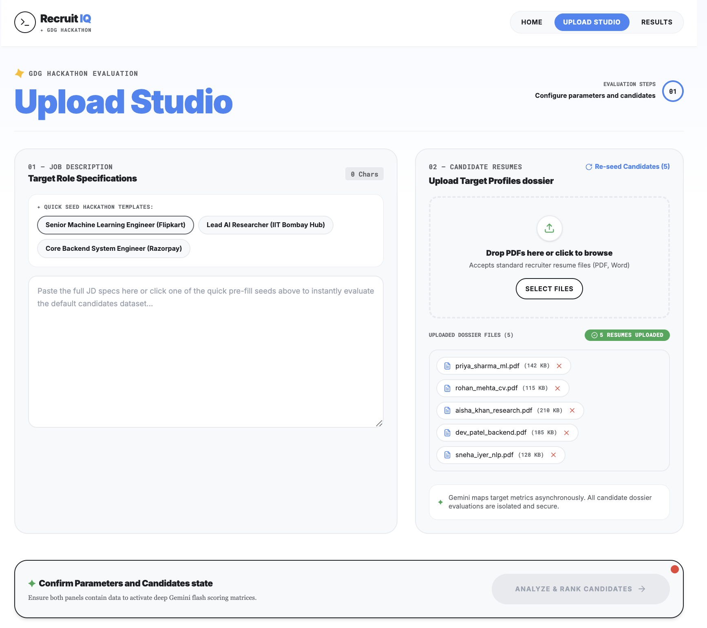
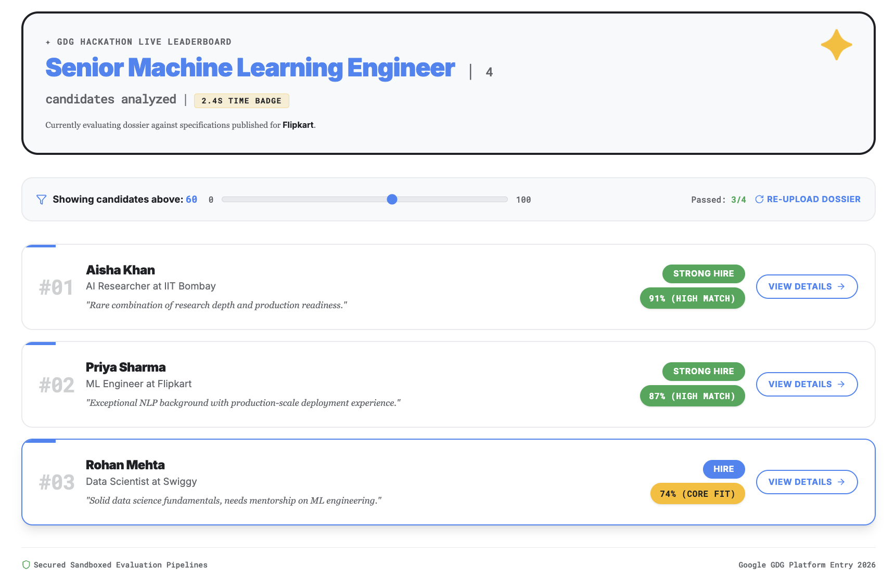
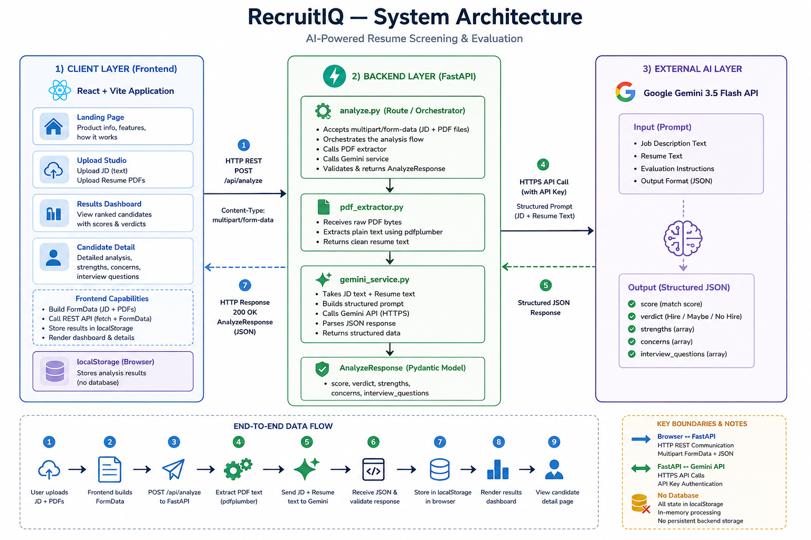

<div align="center">

# ✦ Recruit IQ
### AI-Powered Resume Screening & Ranking Engine 
**Built for Google Developer Groups Hackathon · Pune 2026**


</div>

---

## 📌 What is Recruit IQ?

**Recruit IQ** is an intelligent recruiter assistant that eliminates the manual effort of resume screening. A recruiter pastes a Job Description, uploads a batch of candidate PDFs, and within seconds gets a ranked shortlist.

The system doesn't just match keywords. It understands context, infers candidate strength, and provides a hiring verdict (`Strong Hire / Hire / Maybe / No Hire`) with a one-liner rationale for every candidate.

---

## 🚀 Live Demo (POC)

**Deployed App:** **https://recruitiq-gdg-pune.vercel.app**

▶️ **Screen Recording (Full Demo on YouTube)** — please watch the full end-to-end demo on YouTube:

> Watch on YouTube: [https://youtu.be/l4NXQKvVa-0](https://youtu.be/l4NXQKvVa-0)

---

## 🖥️ Screenshots

### Upload Studio — Configure JD & Upload Resumes


> The recruiter pastes the full Job Description (or uses a quick-seed template for roles like *Senior ML Engineer at Flipkart* or *Lead AI Researcher at IIT Bombay Hub*), then uploads a batch of candidate PDFs for evaluation.

---

### Results — Ranked Candidate Leaderboard


> After Gemini evaluates each candidate, the leaderboard shows candidates ranked by AI score with verdicts like **Strong Hire (91%)**, **Hire (87%)**, etc. Each card includes the candidate's current role and a one-line justification.

---

## 🏗️ System Architecture



## ✨ Features

- **Deep JD Understanding** — extracts skills, experience level, responsibilities, and success criteria
- **Holistic Candidate Scoring** — evaluates career trajectory, skill depth, impact signals — not just keywords
- **Transparent Ranking** — every candidate gets a 0-100 fit score with clear reasoning
- **Explainable Shortlists** — strengths, concerns, and severity levels per candidate
- **Interview Question Generator** — tailored technical and behavioral questions per candidate
- **Verdict System** — Strong Hire / Hire / Maybe / No Hire / Strong No Hire
- **PDF Resume Support** — drag and drop multi-PDF upload with instant text extraction

---

## 🛠️ Tech Stack

| Layer | Technology |
|-------|-----------|
| Frontend | React 18, Vite, Tailwind CSS, Framer Motion |
| Backend | FastAPI, Python, pdfplumber |
| AI | Google Gemini 2.0 Flash |
| PDF Parsing | pdfplumber |
| State | localStorage (client-side) |

---

## 🚀 Getting Started

### Prerequisites
- Python 3.10+
- Node.js 18+
- Google Gemini API Key → [aistudio.google.com](https://aistudio.google.com)

### Backend
```bash
cd backend
pip install -r requirements.txt
cp .env.example .env   # add your GEMINI_API_KEY
uvicorn main:app --reload
```

### Frontend
```bash
cd frontend
npm install
npm run dev
```

Frontend runs on `http://localhost:5173` — Backend on `http://localhost:8000`


<div align="center">
  <sub>Recruit IQ · GDG Pune 2026 · Powered by Gemini</sub>
</div>
